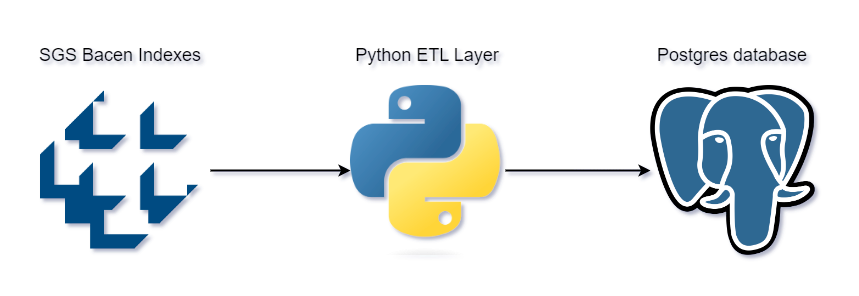

# Python project Bacen Sgs Indexes data extraction

### This is a data extraction and processing project in Python where financial indices are collected from Bacen's SGS time series library and saved in a postgres database table for later use in analytics systems.
 
## Description

#### This project uses a very versatile library for collecting data from Bacen, [python-bcb](https://wilsonfreitas.github.io/python-bcb/). It uses the library's SGS get function to obtain the monthly financial indices of the main interest rates in Brazil that influence various aspects of the country's economy. These indexes are organized in a pandas dataframe and saved in a table in the postgres database.
&nbsp;


## Table of contents
- Prerequisites
- Installation
- Settings
- Usage

### Prerequisites

#### To run the project on your local machine, you must have Python version 3 installed and the Postgres database with public access to the database.

### Installation

#### To run the project script it is necessary to install the following libraries:

```bash
  pip install python-bcb 
  pip install pandas
  pip install sqlalchemy
  pip install dotenv
```

### Settings

#### To save the data correctly in your database, you need to change the variables present in the `.env` file with the credentials you have.

```shell
HOST=your_host_here
PORT=port_here
DATABASE=databse_here
USER=user_here
PASSWORD=user_password_here
SCHEMA=database_schema
```

### Usage

#### Inside the root directory, open the command prompt and run the command

```shell
python exec.py
```

#### If the settings are correct and all libraries are installed, you will receive a return on the screen with the total number of rows inserted in the database table.

## Author
- Tiago Bratz Heck
##### Access my [LinkedIn](https://www.linkedin.com/in/tiago-bratz-heck-0b9b5696/) profile.

